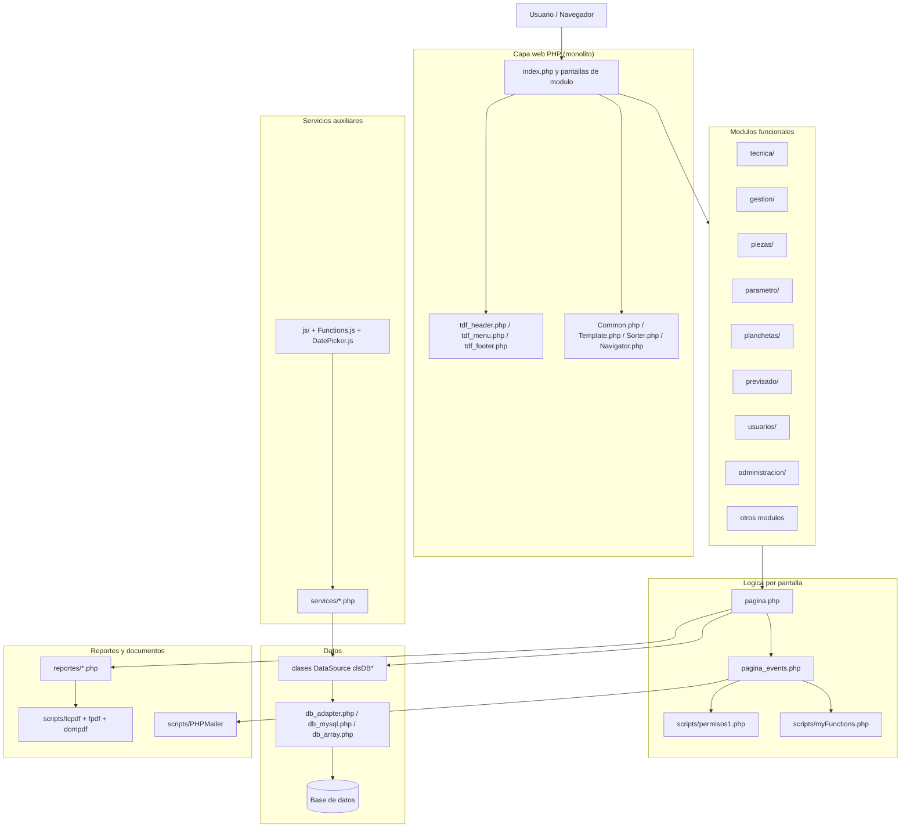
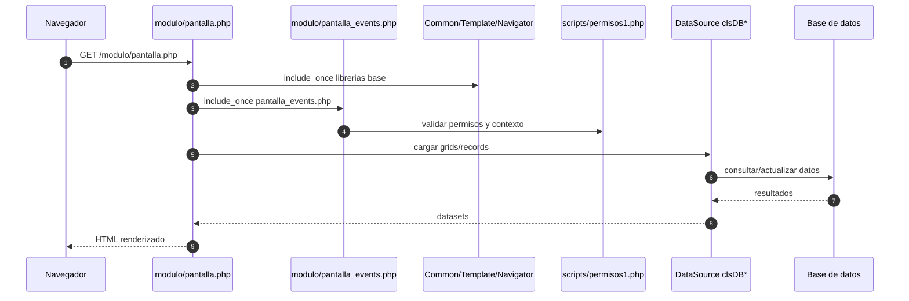

# Arquitectura del sistema Catastro TDF

Este documento describe la estructura principal del codigo fuente y el flujo de ejecucion de la aplicacion.

## Vista general de arquitectura

## Flujo tipico de una pantalla

## Notas de organizacion

- Patron dominante: `pagina.php` + `pagina_events.php`.
- Estructura de clases frecuente: `clsGrid*`, `clsRecord*`, `*DataSource`.
- Los endpoints en `services/` alimentan componentes de UI dinamicos (autocompletes, listas dependientes y respuestas JSON).
- El sistema centraliza layout en archivos `tdf_*` y utilidades en `scripts/`.
